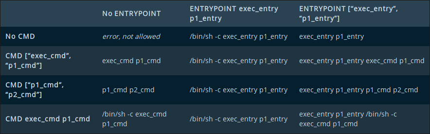

# Docker Cheat Sheet


## Contents

[What is Docker & Why Use It](#What-is-Docker-And-Why-Use-It)

[Docker Jargon](#Docker-Jargon)

[Dockerfile](#Dockerfile)

[Docker Compose](#Docker-compose)

[CLI](#CLI)

[Tools for using docker](#Tools-for-using-docker)

[Deployment](#Deployment)


# What is Docker And Why Use It

- Docker is a tool that deploys software applications in containers, which allows easy deployment of applications, with a standardized unit
- Laymens terms - containers are like virtual machines, which run an image, which is like a bootable iso, or disk
- the difference between VM's and containers is docker leverages lower level linux, which is much faster than VM's approach of running on virtual hardware on the host OS
- Docker Compose is a multi-service orchestration tool, which will spin up multiple images, e.g a service and all its related services, such as a mail server, can link them in any way you want, and can have containers depending on other ones, so you only need to run 1 command to deploy an entire service

## Why use it locally?

- Use mock services/real services without installation, as well as services not being available on a certain OS (Windows 👀)
- same environment as prod
- Consistent dev environment for the entire team
- Can use multiple versions of the same language without having to work with hackarounds like nvm

## Why use it for staging/prod

- Easy deployment, as images only need to be pulled and run, and will run exactly the same on any device that can run docker, and can even be automated with ECS or CI/CD platforms


# Docker Jargon

- Image - Disk image, built from a dockerfile, immutable once built
- Container - The "virtual machine", runs an Image
- Dockerfile - A script for building docker images
- Compose - A tool for defining multi-service applications, defined from multiple images, and can be deployed via single command `docker-compose up`
- Registry - A repository for images, like npm or maven, e.g Docker Hub or ECR
- Volumes - gives containers access to the host filesystem, as files changes made inside a docker container are lost on the stop of an image, like a virtual machine's mounts
- Tag - A label that can be applied to an image, like the version number, or environment, so a specific version can be easily identified
- Networks - Networks are what allow containers to communicate with each other and the host machine, the most important part of networks is the mode, the two most common ones are listed below:
    - bridge - The default network driver, for containers that need to communicate with each other
    - host - This removes isolation between the container and host networks, and allows the container to communicate with the host via `[localhost](http://localhost)` N.B: host network is not available on Docker Desktop on Windows on MacOS, use `host.docker.internal` which resolves to the host IP for the container
    

# Dockerfile

The script for building docker images, executed by running `docker build`

Syntax reference:

- `FROM` - A base image to start the build from, e.g a specific java/node version, or OS e.g Ubuntu or a lightweight OS such as alpine
- `RUN` - run a command in the images shell, such as a bash command
- `CMD` - the default command to run to start the service in the container, doesn't need to point to an executable if an `ENTRYPOINT` is defined, then it will define the default arguments to pass to the entrypoint
- `LABEL` - allows adding of metadata to an image, and is made up of a key-value pair
- `EXPOSE` - marks a port as one that can be exposed (to other containers, not to the host) on runtime, these ports have to be opened on run of the image
- `ENV` - Environmental variables to set at runtime, made up of key-value pair
- `COPY` & `ADD` - these 2 have essentially the same functionality, copying files from an external source into the image, with `COPY` only being able to copy files directly from your filesystem, but `ADD` being able to handle tar files, and download from URL's
- `ENTRYPOINT` - essentially the same as `CMD`, but `ENTRYPOINT` must have an executable
- Sidenote - `CMD` & `ENTRYPOINT` interactions



- `VOLUME` - creates a mount point with a specified name and path, the mount point on the host system must be defined on run for the mount point to be used
- `USER` - Defines the user that `RUN` `CMD` and `ENTRYPOINT` should run as.
- `WORKDIR` - The working directory, or project root, of the container, this will be the default path if a fully qualified path is not used
- `ARG` - allows an argument to be passed at build time, and used in other stages of the build process, by using `${}`
- `ONBUILD` - allows any of the instructions (except FROM) to be run if the image is used as a base for another image
- `STOPSIGNAL` - The signal that will be sent to the container to stop the running service, can be a number or a fully qualified signal name e.g `SIGINT`, `SIGTERM` or `SIGKILL`
- `HEALTHCHECK` - The command that will be run to check the health of the container, can have an interval and timeout flag specified
- `SHELL` - the default shell to be used in the container to run commands, defaults to `["/bin/sh", "-c"]`
- `MAINTAINER` - Maintainer used to be used to set the author of an image, but it has since been deprecated, and `LABEL` should be used in its place e.g `LABEL maintainer="user@example.com"`

## Example Dockerfile

```docker
FROM openjdk:8-jdk
LABEL maintainer="mail@thejonsey.com"
EXPOSE 8080
HEALTHCHECK --interval=5m --timeout=5s  \
	CMD curl -f http://localhost:8080/actuator/health || exit 1
WORKDIR /usr/share/app

COPY . .

RUN mvn clean package \
	mv target/*.jar app.jar

CMD ["-jar", "/usr/share/app/app.jar"]

ENTRYPOINT ["java"]
```

this would then be built and run by running `docker build -t example:latest . && docker run -p 8080:8080 exaple:latest`


# Docker Compose

## Service configuration

A very basic service configuration would be:

```yaml
version: "3.7" -- The version of docker compose to use
services: -- A list of services inside the docker-compose file
	web: -- the name of a service in the application
		image: example:latest -- The image to use for this service
		container_name: -- the name of the container
	db:

```

There is a lot of configuration that can be done to services such as

### General config

- `command` - Override the default command of the image
- `container_name`  - The name of the container, which will be used on the command line
- `depends_on` - Starts the services in dependency order, so if you had a web app container that depends on a db container, the db would start first
- `dns` - Specify custom DNS servers for the container, can be single value or list
- `entrypoint` - Override the default entrypoint of the image
- `env_file` - Add environmental variables from a file
- `environment` - Add environmental variables in one of the formats shown below

```yaml
services:
	a:
		environment:
			ip: 10.0.0.1,
			env: staging
	b:
		environment:
			- ip=10.0.0.1
			- env=staging
```

- `expose` - expose ports to linked services
- `external_links` - Link to containers outside docker-compose, specified by container name
- `extra_hosts` - Add extra mappings to the hosts file, as shown below

```yaml
services:
	a:
		extra_hosts:
			- "abc.def:1.2.3.4"
			- "service_name:127.0.0.1"
```

- `healthcheck` Override the default healthcheck for the image as shown below

```yaml
services:
	a:
		healthcheck:
		  test: ["CMD", "curl", "-f", "http://localhost"]
		  interval: 1m30s
		  timeout: 10s
		  retries: 3
		  start_period: 40s
```

- `network_mode` - The network driver to use, as specified in

Also the network_mode can directly point to another service in the same docker-compose file, or container running on docker via the containers name/id as shown below:

```yaml
services:
	a:
		network_mode: "container:example_container_1" -- pointing at external service
	b:
		network_mode: "service:a" -- pointing at service a
```

- `ports` - Exposes ports to the host machine and external network, this is a list, and is defined as `HOST:CONTAINER` so `8080:80` would expose port 80 in the container to port 8080 on the host
- `restart` - Defines the auto restart policy of the container, can be `no`, `always`, `on-failure`, `unless-stopped`
- `stop_signal` - Overrides the stop signal of the image

### Build config

docker-compose can build the image before running if the image isn't found in the local registry, it can either be done basically by pointing to the folder containing the Dockerfile as shown below:

```yaml
services:
	web:
		image: example:latest --image is built with this name and tag 
		build: ./web
```

or it can have configuration options as shown below:

```yaml
services:
	web:
		build:
			context: ./dir --folder to build from
			dockerfile: Dockerfile-2 --can point at an alternate Dockerfile
			args:
				ver: 2.5 --passes arguments to the build process
		image: example:latest --image is built with this name and tag 
```

## Volume Configuration

Volumes can be mounted in 2 ways, the short config or long config

### Short Config

The volumes, like the ports, are defined as `HOST:CONTAINER` as below:

```yaml
service:
	example:
		volumes:
		  # Specify an absolute path mapping
		  - /opt/data:/var/lib/mysql
		
		  # Path on the host, relative to the Compose file
		  - ./cache:/tmp/cache
		
		  # User-relative path
		  - ~/configs:/etc/configs/:ro
		
		  # Named volume
		  - datavolume:/var/lib/mysql
```

### Long config

```yaml
services:
	web:
		volumes:
      - type: volume -- default type of volume, managed by docker
        source: ./mydata --host directory
        target: /data -- container directory
        volume:
          nocopy: true -- disable copying of data from a container when volume created
      - type: bind -- files are mounted from the host to the container
        source: ./static
        target: /opt/app/static
				read_only: true -- fairly self explanatory
```

## Secrets Configuration

Secrets are files that can be read into the container, and put into /run/secrets/{secret_name} in the container, there is a short config and a long config for this

### Short config

```yaml
services:
  example:
    secrets:
      - my_secret
secrets:
  my_secret:
    file: ./my_secret.txt
```

## Long Config

```yaml
services:
  example:
    secrets:
      - source: my_secret
        target: redis_secret -- what to call the file in /run/secrets, defaults to source name
        uid: '103' --sets user to 103
        gid: '103' -- sets group to 103
        mode: 0440 -- sets the mask to 0440
secrets:
  my_secret:
    file: ./my_secret.txt
```

## Network Configuration

Generally the most configuration you will do for networks is something that looks like this:

```yaml
services:
	example:
		networks:
			- example_network

networks:
	example_network:
		driver: host -- if you are using the bridge driver, you dont need this line
```

services can also have aliases (other hostnames) configured for them, for other services to access them via, they can also have a static ipv4 and ipv6 address set against them, as shown below

```yaml
services:
	example:
		networks:
			example_network:
				aliases:
					- web-app
				ipv4_address: 10.0.0.1
				ipv6_address: 2001:3984:3989::10

networks:
	example_network:
		driver: host -- if you are using the bridge driver, you dont need this line
```

so other other containers connected to the same network can send a request to that service via:

- example
- web-app
- 10.0.0.1
- 2001:3984:3989::10

if you want to set a network to be accessible from standalone containers or services in other docker-composes, you configure it as so

```yaml
networks:
	example_network:
		attachable: true
		name: example
```

then to connect to this network from another docker-compose, you configure it as:

```yaml
networks:
	example_network:
		external: true
		name: example
```

## Example

```yaml
version: '2'
services:
  mailhog:
		container_name: mailhog
    image: mailhog/mailhog
    ports:
      - '1025:1025'
      - '8025:8025'
  app:
		container_name: spring
    build: .
		image: the-jonsey/spring-app:latest
		depends_on:
			- mailhog
		ports:
      - '8001:8001'
    links:
      - "mailhog:smtp"
    environment:
      - SPRING_PROFILES_ACTIVE=docker
```


# CLI

## Docker

The rest of the docs for the docker cli can be found at [https://docs.docker.com/engine/reference/commandline/cli/](https://docs.docker.com/engine/reference/commandline/cli/)

### `docker run`

Runs an image in a new container, either with the default image command, or a custom command

`docker run [OPTIONS] IMAGE [COMMAND] [ARG...]`

the flags for this command include:

- `--detach, -d` - runs the container in the background
- `--env, -e` - pass an env to the container, e.g `--e "USERNAME=admin"`
- `--env_file` - read env variables from a file to the container
- `--name` - assign a name to the container
- `--net, --network` - connect to a docker network
- `--publish , -p` - expose a containers port(s) to host, in same format as docker_compose
- `--rm` - automatically remove container when it exits
- `--volume, -v` - mount a volume to the container

Examples

- detached java app
- attached certbot

### `docker build`

Build an image from dockerfile

`docker build [OPTIONS] PATH | URL`

Can build image from local dockerfile, or by pulling a dockerfile from an URL

the flags for this command include:

- `--tag, -t` - Name and optionally tag the image e.g `example:latest`

### `docker exec`

Run a command in a running container

`docker exec [OPTIONS] CONTAINER COMMAND [ARG...]`

the flags for this command include:

- `--detach, -d` - run the command in background
- `--interactive, -i` - keep input open
- `--tty, -t` - allocates a terminal
- `--user, -u` - user to run the command as

The most common command you'll be running with docker exec is:

`docker exec -it CONTAINER sh`

which opens a shell in the container

### `docker images`

Lists the images in your local registry in the format: 

```bash
REPOSITORY          TAG                 IMAGE ID            CREATED             SIZE
mysql               latest              3a5e53f63281        2 days ago          465MB
openjdk             8-jdk               f8146facf376        2 weeks ago         488MB
```

Where `REPOSITORY` is the name of the image and `TAG` is the version

### `docker ps`

Lists containers

`docker ps [OPTIONS]`

the flags for this command include:

- `--all, -a` - Show all containers, not just running containers
- `--last, -n` - Shows n last created containers
- `--latest, -l` - shows the latest container
- `--size, -s` - shows total file sizes

It lists the containers in the following format:

```bash
CONTAINER ID        IMAGE                 COMMAND                  CREATED             STATUS                     PORTS                    NAMES
72b8782fd340        theiaide/theia:next   "node /home/theia/sr…"   3 months ago        Exited (255) 7 weeks ago   0.0.0.0:3000->3000/tcp   zealous_williamson
```

### `docker pull`

Pulls an image from a registry

`docker pull [OPTIONS] NAME[:TAG]`

e.g

`docker pull openjdk:8-jdk`

### `docker rm/rmi`

`docker rm [OPTIONS] [...CONTAINERS]`

Delete one or more containers

the flags for this command include:

- `--force, -f` - Force removal of running container
- `--link, -l` - Remove a lonk
- `--volumes, -v` - Remove the associated volumes

A useful `docker rm` command is the one to remove all stopped containers: 

`docker rm $(docker ps -a -q)`

### `docker rmi`

`docker rmi [OPTIONS] [...IMAGES]`

Delete one or more images

the flags for this command include:

- `--force, -f` - Force removal of the image

### `docker start/stop/kill/restart/pause/unpause`

`docker start [OPTIONS] [...CONTAINERS]`

Start stopped containers

the flags for this command include:

- `--attach, -a` - show containers logs in shell
- `--interactive, -i` - attach input to container

`docker stop [OPTIONS] [...CONTAINERS]`

Stop containers

the flags for this command include:

- `--time, -t` - the timeout to wait before killing it

`docker kill [OPTIONS] [...CONTAINERS]`

Kill containers

`docker restart [OPTIONS] [...CONTAINERS]`

Restart containers

the flags for this command include:

- `--time, -t` - the timeout to wait before killing it

`docker pause [...CONTAINERS]`

Pause all processes in containers

`docker unpause [...CONTAINERS]`

Resume all processes in containers

### `docker system prune`

Remove unused data

`docker system prune [OPTIONS]`

the flags for this command include:

- `--all, -a` - Remove all unused images
- `--force, -f`  - Don't prompt for confirmation
- `--volumes` - Remove unused volumes

### `docker login`

Login to a image registry

`docker login [OPTIONS] [SERVER]`

the flags for this command include:

- `--password, -p`
- `--username, -u`
- `--password-stdin` - Take the password from stdin

### `docker push`

Push image to remote image registry

`docker push [OPTIONS] NAME[:TAG]`

### `docker tag`

Tag an image

`docker tag SOURCE_IMAGE[:TAG] TARGET_IMAGE[:TAG]`

## Docker-compose

The rest of the docs for the docker-compose cli can be found at [https://docs.docker.com/compose/reference/overview/](https://docs.docker.com/compose/reference/overview/)

### `docker-compose`

`docker-compose [OPTIONS] SUBCOMMAND`

This is the main command for docker-compose and has flags you can use while using all subcommands.

the flags for this command include:

- `--file, -f` - Specify an alternate docker-compose file, can be chained with multiple for e.g environment overrides

an example command would be

`docker-compose -f docker-compose.yml -f docker-compose.dev.yml up -d`

### `docker-compose start/stop/kill/restart/pause/unpause/ps/rm/exec`

These run the same as the normal docker commands, but instead of the fully qualified container name/id found in `docker ps` use the `container_name` you set in the `docker-compose.yml` file

### `docker-compose up`

`docker-compose up [OPTIONS] SERVICE`

Builds, (re)creates, starts, and attaches to containers for a service, if the service is left blank, the command starts all services in the docker-compose file

the flags for this command include:

- `--detach, -d` - runs the container(s) in the background
- `--force-recreate` - recreates containers from images
- `--build` - build images before starting containers

### `docker-compose down`

`docker-compose down [OPTIONS]`

Stops containers and removes containers, networks, volumes, and images created by `up`.

the flags for this command include:

- `--rmi type` - Remove images, types are
    - `all` - all images used by services
    - `local` - only images built locally that dont have a custom tag
- `--volumes, -v` - remove names orphans in docker-compose file
- `--timeout, -t` - Specify a shutdown timeout in seconds.


# Tools for using docker

## Dockstation

[https://dockstation.io/](https://dockstation.io/)

### Projects

Dockstation is great for those new and intermediate at docker, with it's intuitive GUI and docker-compose designer, which lets you drag and drop services into the scheme:


Dockstation gives easy access to configure container env variables, volumes, and exposed ports

### Containers

The containers section lets you see logs of all the containers running, and see the CPU, network, and memory usage of a container, and compare multiple containers usages.

Dockstation also has the ability to connect to a remote docker-daemon, meaning you can monitor containers, and stop/start containers on a remote system.

## Lazydocker

[https://github.com/jesseduffield/lazydocker](https://github.com/jesseduffield/lazydocker)


LazyDocker is more for those who prefer command line over GUI, and includes more information than Dockstation, its features include:

- CPU Usage and image of a running container at a glance
- List of local images, and sizes of those images at a glance
- pruning containers, images, or volumes that are hogging up disk space
- restarting/removing/rebuilding containers/services
- Full stats and config of a container
- the `top` of a container
- If ran from a folder containing a docker-compose file
    - Logs of all the services together
    - A preview of the docker-compose file
    - The status and CPU usage of all services in a docker-compose file

# Deployment

## General Notes

The two main points about deploying Docker is:

- Build the image on your CI/CD platform
- *DONT* use docker-compose for deployed services unless you must

## AWS CodePipeline → AWS ECS

AWS Codepipeline can be set to build a docker image, via CodeBuild, then push it to ECR via CodeDeploy, which triggers ECS to load in the latest task definition, for more information, see: [https://aws.amazon.com/blogs/compute/continuous-deployment-to-amazon-ecs-using-aws-codepipeline-aws-codebuild-amazon-ecr-and-aws-cloudformation/](https://aws.amazon.com/blogs/compute/continuous-deployment-to-amazon-ecs-using-aws-codepipeline-aws-codebuild-amazon-ecr-and-aws-cloudformation/)

## Github Actions → AWS ECS

Github Actions has actions to build docker images, and to deploy to Amazon ECS, which works similar to the AWS CodePipeline solution, most of which can be found on the aws-actions org on github [https://github.com/aws-actions](https://github.com/aws-actions)

an example of using these would be:

```yaml
name: Push to ECS

on:
	push:
		branches: master

jobs:
	build:
		runs-on: ubuntu-latest

		steps:
			- name: Configure AWS Credentials
	      uses: aws-actions/configure-aws-credentials@v1
	      with:
        aws-access-key-id: ${{ secrets.AWS_ACCESS_KEY_ID }}
        aws-secret-access-key: ${{ secrets.AWS_SECRET_ACCESS_KEY }}
        aws-region: us-east-2

			- name: Login to Amazon ECR
	      id: login-ecr
	      uses: aws-actions/amazon-ecr-login@v1

	    - name: Build, tag, and push image to Amazon ECR
	      env:
	        ECR_REGISTRY: ${{ secrets.registry }}
	        ECR_REPOSITORY: ${{ secrets.repo }}
	        IMAGE_TAG: ${{ github.sha }}
	      run: |
	        docker build -t $ECR_REGISTRY/$ECR_REPOSITORY:$IMAGE_TAG .
	        docker push $ECR_REGISTRY/$ECR_REPOSITORY:$IMAGE_TAG
	
	    - name: Logout of Amazon ECR
	      if: always()
	      run: docker logout ${{ secrets.registry }}

			- name: Render Amazon ECS task definition
	      id: render-web-container
	      uses: aws-actions/amazon-ecs-render-task-definition@v1
	      with:
	        task-definition: task-definition.json
	        container-name: back-end
	        image: ${{ secrets.registry }}/${{ secrets.repo }}:${{ github.sha }}
	
	    - name: Deploy to Amazon ECS service
	      uses: aws-actions/amazon-ecs-deploy-task-definition@v1
	      with:
	        task-definition: ${{ steps.render-web-container.outputs.task-definition }}
	        service: back-end
	        cluster: staging
```

## Manual → VPS

The deployment to a VPS is in 5 stages:

- Build image - `docker build`
- Tag image - `docker tag`
- Login to registry - `docker login`
- Push image to registry - `docker push`
- Login to VPS - `ssh`
- Pull image from registry - `docker pull`
- Run image in container - `docker run`